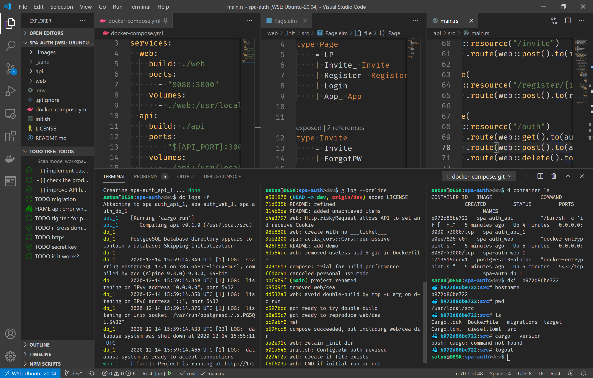

# works-stem-spa-auth

__Under development:__

- [ ] implement password forgetting handler
- [ ] check the production part of the Dockerfile
- [ ] improve API hot reload speed

[demo]: _images/demo.gif
[docker]: https://docs.docker.com/get-docker/
[how to email]: https://github.com/satu-n/study-actix-web-simple-auth-server#using-sparkpost-to-send-registration-email
[tips]: https://github.com/satu-n/tips

## What's this

* Baby of SPA with user authentication &#x1F476;
* 1 command to get ready for dev
* Hot reload (HMR) both client/server side
* Prefix `stem` derives from `stem cell`, which has potential to be any organ

### Demo

![demo][demo]

### Feature

* __Elm & Rust__: fast, accurate, safe development and production
* __Docker__ container dev: portability & reproducibility
* __Email__ invitation and identification
* __Cookie__ authentication
* __No navigation__: single URL & no browser back/forward

## How to run

Prerequisites:

* [Docker & Docker Compose][docker]
* git
* bash

Enter the command as follows to access http://localhost:8080

```bash
APP_NAME='my_spa' &&
git clone https://github.com/satu-n/works-stem-spa-auth.git $APP_NAME &&
cd $APP_NAME &&
bash init.sh $APP_NAME \
'new!database!password******' \
'SparkPost-API-KEY&==' \
'sending.email.address@my.domain.com' &&
unset APP_NAME &&
docker-compose run --rm -e CREATE=true -u "$(id -u $USER):$(id -g $USER)" web &&
docker-compose up -d &&
docker-compose logs -f
```

Configure 4 '`single quoted params`'.
[My actix-web learning log][how to email] may help you.

When the containers are up,
source code updates will be reflected automatically.

The dev screen looks like this:



```bash
docker-compose down
```

to finish today's work.

## Thank you for reading!

See also [my dev tips][tips] if you like.
